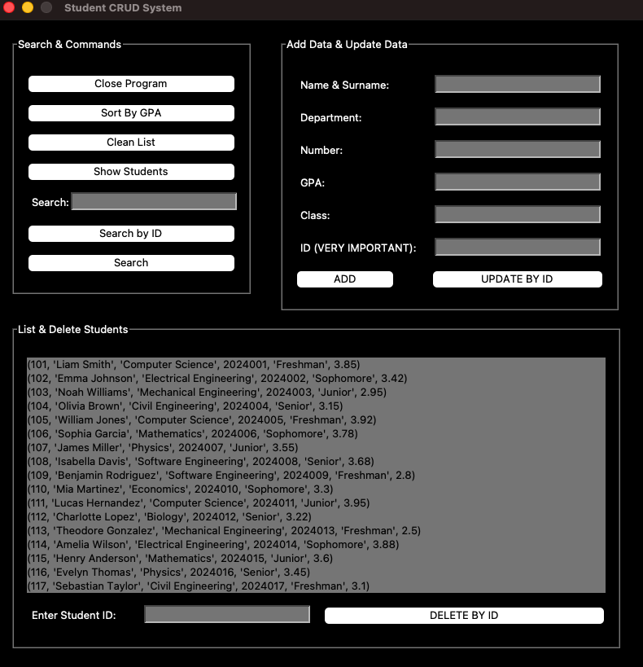
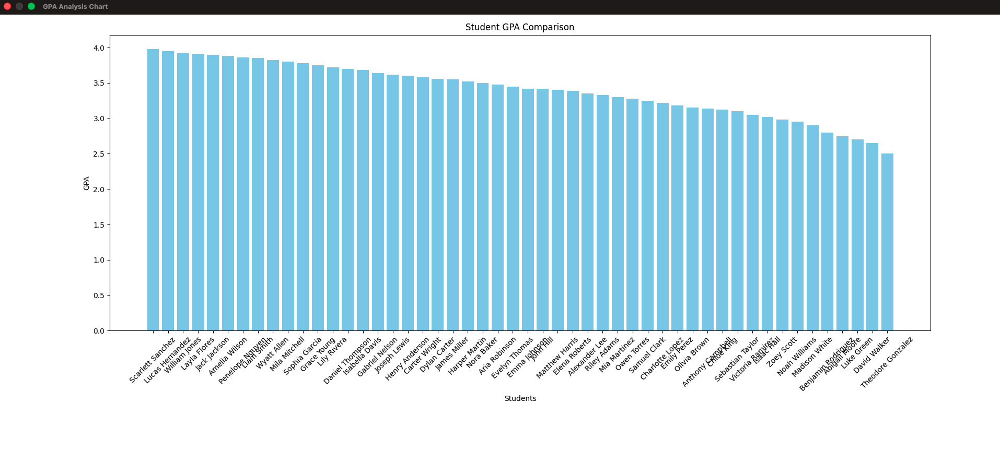

# 🎓 Student CRUD & Data Analyzer


This project is a simple yet effective **Student Management System**. It uses Python for the UI and logic, and SQL Server running on Docker for data storage.

---

##  How it Works

The project connects different technologies to manage and analyze data:

1. **Database (Docker & MSSQL):** We use a **Microsoft SQL Server** inside a Docker container. This makes it very easy to set up the database on any computer.
2. **Connection (pyodbc):** Python talks to the SQL database using the **pyodbc** library. It sends queries to save, update, or delete student data.
3. **User Interface (Tkinter):** The app has a clean "Dark Mode" interface built with **Tkinter**. It is easy to use and fast.
4. **Charts (Matplotlib):** The app takes student grades (GPA) from the database and creates a bar chart using **Matplotlib**.

---

##  Previews

### Main Application Dashboard
The main interface built with Tkinter, featuring a clean "Dark Mode" and all CRUD operations.


### Real-Time GPA Analysis Chart
This chart window pops up instantly when you click "Sort by GPA," showing visual performance data using Matplotlib.


---

##  Main Features

* **CRUD Operations:** You can Add, List, Update, and Delete students.
* **GPA Analysis:** See student performance in a separate chart window.
* **Smart Search:** Find students by their ID or name using the search bar.
* **Secure Setup:** Your database password stays safe in a `.env` file.
* **Ready to Use:** It comes with 50 random student records (created by AI) so you can test it immediately.

---

##  Setup

1. **Install Dependencies:**
   ```bash
   pip install -r requirements.txt

2. Database Setup:

Start your MSSQL container on Docker.

Run the code in database.sql to create the tables and add the test data.

3. Configure .env:
Create a .env file and enter your database info:

DB_SERVER=your_address
DB_DATABASE=students
DB_USERNAME=your_username
DB_PASSWORD=your_password

4. Run:

python main.py

## Special Thanks

First of all, thank you for taking the time to look at my project. As a first-year Computer Science student, this is my very first project, and it means a lot to me.

My goal with this project was to go beyond simple coding and try to build something with a professional mindset—integrating databases, using Docker, and creating clean documentation. I am doing my best to learn and improve every day. Furthermore I am working on a new project that will be integrated with Machine Learning. If you want to see that journey, please keep an eye on my profile!

If you have any feedback or suggestions, I would be more than happy to hear them!